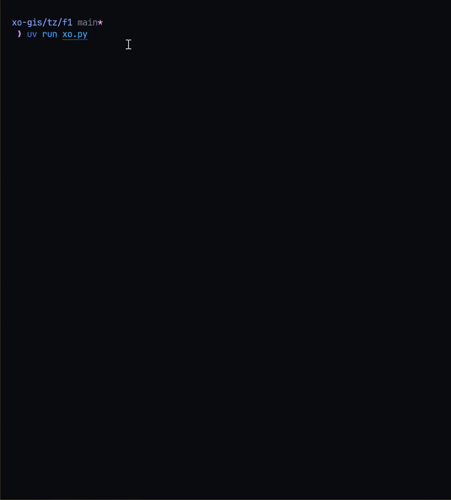

<p align="center"><a href="https://x.com/xyizko" target="_blank" rel="noopener noreferrer">
</a></p>

<p align="center"><a href="https://x.com/xyizko" target="_blank" rel="noopener noreferrer">
</a></p>

<a href="https://hits.seeyoufarm.com"></a>

<p align="center"><a href="https://x.com/xyizko" target="_blank" rel="noopener noreferrer">
</a></p>

<h1 align="center"><code>xo-gis</code></h1>
<h2 align="center"><i> Simple Github Issues and PR Scraper </i></h2>

[](https://github.com/astral-sh/uv)


1. [🎥 Demo](#-demo)
   1. [🍬 Features](#-features)
2. [🤔What](#what)
3. [💽 Setup](#-setup)
   1. [😿 Common Problems](#-common-problems)
4. [🎩 License](#-license)

# 🎥 Demo



## 🍬 Features

✅ Captures both screenshots and scrape to `.txt` and `.json`

✅ Set any type of User-Agent via `config/useragent.txt`

✅ Fast since it uses `https://docs.astral.sh/uv/`


# 🤔What

Research tool to quickly scrape the 1st page of the **github** _issues_ and _prs_ from a given `github repo`. Its _screenshots_ are taken and the headings of the _issues and prs_ are stored as `.txt` and `.json`

# 💽 Setup

1. Download and install [uv](https://docs.astral.sh/uv/getting-started/installation/)

```sh
curl -LsSf https://astral.sh/uv/install.sh | sh
```

2. Download this repo

3. Run [`setup.sh`](./setup.sh)

- Bash script which will install required python libraries.
- Note this uses [`playwright-python`](https://playwright.dev/python/docs/intro) and will also install its dependencies.

4. Enter the required repos to be scraped in the [`config/repos.txt`](./config/repos.txt) in the follwing format

```ml
org1/repo1
org2/repo2
.
.
```

5. If you want to use a specific user agent.

- Make a new file `config/useragent.txt` with the required _user-agent_ or defaults will be used.

6. Execute

```py
uv run xo.py
```

- A new `reports` directory will be created with each repo as its own directory containing its scraped assets

## 😿 Common Problems

Some repositories may not be scraped properly if it uses _pinned issues_. 


# 🎩 License

**TODO**
